  <!-- Animated Main Header -->
  

    

  <!-- Section: About Me -->
  <h2>⚡ About Me</h2>
  

    

  <!-- Section: Dynamically generated featured projects -->
  <h2>🚀 Featured Projects</h2>
  

    

  <!-- Section: GitHub Stats -->
  <h2>📊 GitHub Analytics</h2>
  

    

